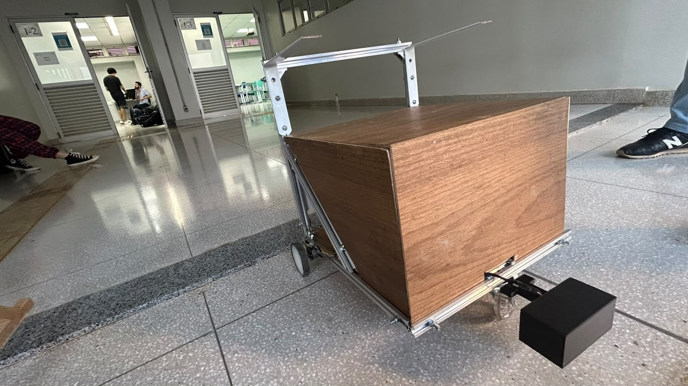
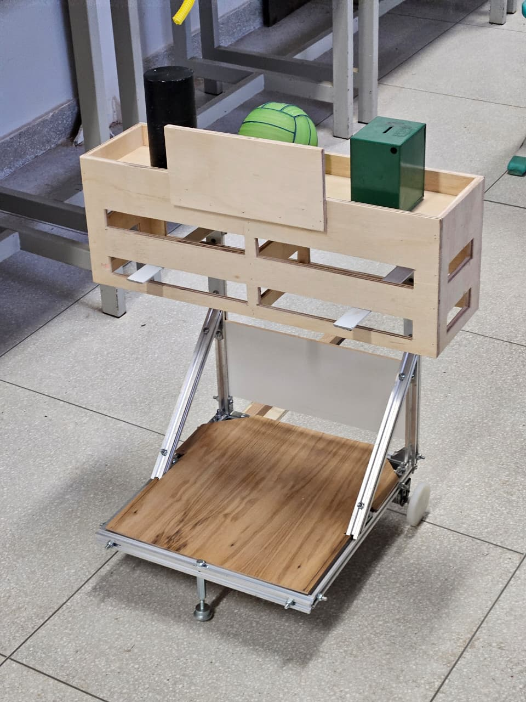
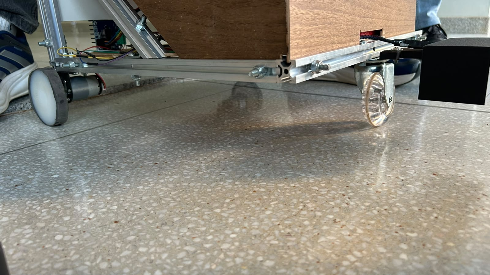
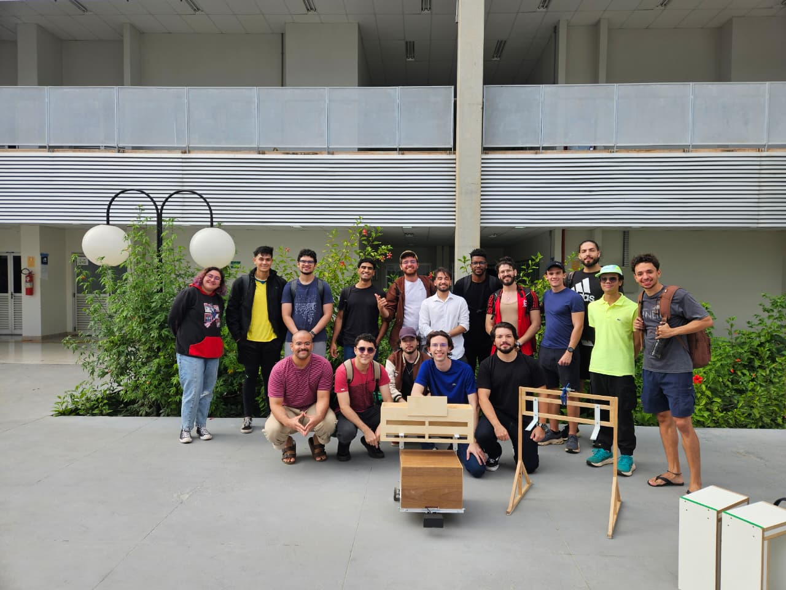

# Carrinho Autônomo — PI2

<p align="center">
  
</p>

<p align="center">
  
  
  
  
</p>

Versionamento **pessoal** do meu trabalho no projeto de um **carrinho autônomo de
transporte de carga**, desenvolvido na disciplina **Projeto Integrador 2 (PI2)** da
UnB Gama. Este repositório é o meu acompanhamento do desenvolvimento — foco no firmware
embarcado (ESP32-S3) e na interface de controle.

> Repositório individual de estudo/versionamento. Não substitui o repositório oficial
> do grupo; serve para eu organizar e evoluir a minha parte do código.

📌 **Pinagem completa e esquemático de ligações** (todas as ESPs, sensores e drivers):
veja [HARDWARE.md](HARDWARE.md).

## O que é o projeto

Robô móvel que navega de forma autônoma para transportar carga entre pontos demarcados.
A eletrônica é baseada em **ESP32-S3**, com dois motores DC (N20) em tração diferencial,
drivers BTS7960, sensores infravermelhos e encoders. A arquitetura prevê duas ESP32-S3
("mestre" e "escravo") se comunicando por UART.

## Galeria

| Estrutura montada | Chassi e eletrônica |
|:---:|:---:|
|  |  |
| Carroceria de carga sobre o chassi de perfil de alumínio. | Motores N20, rodas e a eletrônica embarcada sob a plataforma. |

<p align="center">
  
  <br>
  <sub>Equipe do projeto (Grupo 8 — PI2 / FGA-UnB).</sub>
</p>

## Estrutura do repositório

```
.
├── esp_slave/        Firmware da ESP32-S3 escrava (motores + sensores + encoders + giroscópio + controle)
├── esp_master/       Firmware da ESP32-S3 mestre (Wi-Fi SoftAP + servidor web + UART)
├── web/              Interface de controle (página web + Web Bluetooth)
└── HARDWARE.md       Pinagem completa e esquemático de ligações (todas as ESPs e sensores)
```

## esp_slave — estado atual

Firmware em C sobre **ESP-IDF v5.5** + FreeRTOS. Recursos:

- Acionamento dos dois motores via **PWM (LEDC, 20 kHz)** e drivers BTS7960.
- **Sensor de queda (IR HW-201):** ao detectar borda, bloqueia frente e giros, permitindo
  apenas ré e parada.
- **Encoders (PCNT)** em cada roda.
- **Controle de linha reta em malha fechada** (PI de rumo): iguala as velocidades das
  rodas e mantém o rumo, compensando desbalanço dos motores e a queda de tensão da bateria.
- **Rota de teste em loop:** frente ~1 m → giro 45° → repete (para avaliar a repetibilidade
  do trajeto).
- Controle por **BLE** (dispositivo `ROBO_BB8`) compatível com `web/controle_ble.html`.

### Comandos (BLE, característica `0xFF01`)

| Comando | Ação |
|---|---|
| `F` / `B` | frente / ré |
| `L` / `R` | girar esquerda / direita |
| `A` | inicia a rota em loop |
| `S` | parar (aborta a rota) |

## Como compilar e gravar (esp_slave)

Pré-requisito: **ESP-IDF v5.5+**.

```bash
cd esp_slave
idf.py set-target esp32s3
idf.py build
idf.py -p <PORTA> flash monitor
```

## Interface de controle

Abrir `web/controle_ble.html` no **Chrome ou Edge** (Web Bluetooth), clicar em
*Conectar Bluetooth* e selecionar `ROBO_BB8`.

## Próximos passos

- Giroscópio (IMU MPU-6050) para melhorar o rumo e as curvas.
- Comunicação UART entre a ESP escrava e a mestre.
- Firmware da ESP mestre (Wi-Fi/web + recepção de rotas).
- Máquinas de estado da missão.
