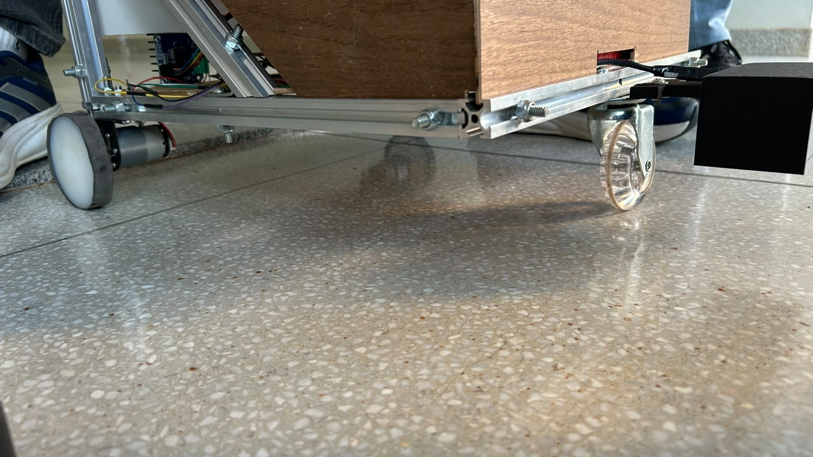
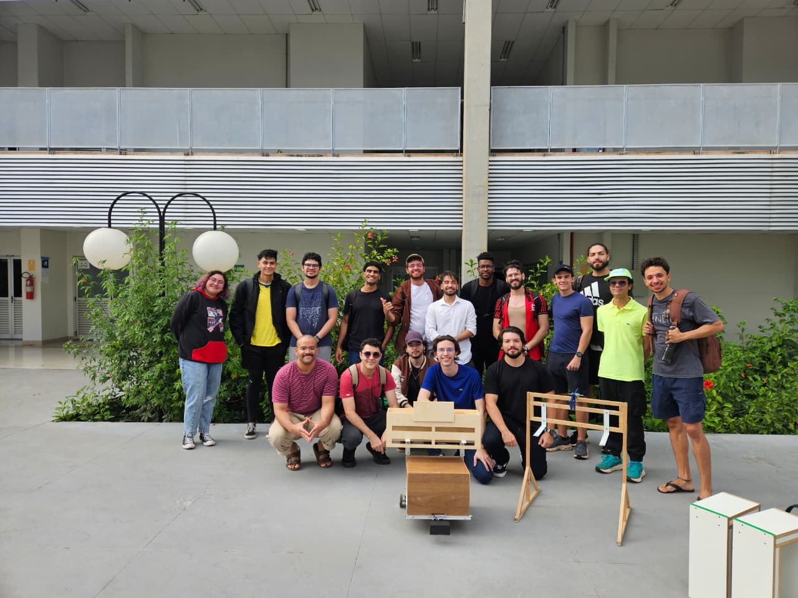

# Carrinho Autônomo — PI2 · *Wall-Eight*

<p align="center">
  
</p>

<p align="center">
  
  
  
  
  
  
</p>

Versionamento **pessoal** do meu trabalho no projeto de um **carrinho autônomo de
transporte de carga** — apelidado de **Wall-Eight** (o formato lembra o robô Wall-E, e
somos o grupo **8** → *eight*). Desenvolvido na disciplina **Projeto Integrador 2 (PI2)**
da UnB/FGA. Este repositório é o meu acompanhamento do desenvolvimento, com foco no
**firmware embarcado (ESP32-S3)** e na **interface de controle**.

> Repositório individual de estudo/versionamento. Não substitui o repositório oficial
> do grupo; serve para eu organizar e evoluir a minha parte do código.

**Pinagem completa e esquemático de ligações** (todas as ESPs, sensores e drivers):
veja [HARDWARE.md](HARDWARE.md).

## O que é o projeto

Robô móvel que navega de forma autônoma para transportar carga entre pontos demarcados.
A eletrônica é baseada em **duas ESP32-S3** ("mestre" e "escravo") comunicando por **UART**,
com dois motores DC (encoder Hall) em tração diferencial, drivers **BTS7960**, encoders por
**PCNT**, um **giroscópio MPU-6050** para controle de rumo e um sensor **IR reflexivo** de
detecção de queda. O operador monta a rota em uma **interface web** embarcada; o mestre
enfileira os comandos e os despacha ao escravo, que executa cada movimento em malha fechada.

## Demonstração em vídeo

| Operação completa (navegação autônoma) | Apresentação final — chegada ao ponto de entrega |
|:---:|:---:|
| [](https://youtu.be/V_NZtubakYI) | [](https://youtu.be/hiYJ1DdmhFE) |
| Robô cumprindo a missão completa de navegação com a carga. | Chegada autônoma ao ponto de entrega na apresentação. |

Bônus — [Compilação do firmware no ESP-IDF](https://youtu.be/i_dLAfPBTEo).

## Galeria

| Estrutura montada | Chassi e eletrônica |
|:---:|:---:|
|  |  |
| Carroceria de carga sobre o chassi de perfil de alumínio. | Motores, rodas e a eletrônica embarcada sob a plataforma. |

<p align="center">
  
  <br>
  <sub>Equipe do projeto (Grupo 8 — PI2 / FGA-UnB).</sub>
</p>

## Arquitetura

```
        Navegador (interface web embarcada)
                    │  HTTP (monta e envia a rota em JSON)
                    ▼
        ┌─────────────────────────┐         UART1 · 3 bytes [MSB, LSB, XOR]
        │      ESP32-S3 MESTRE     │  ◄─────────────────────────────────────┐
        │  Wi-Fi (SoftAP/STA)      │   ACK / DONE / ABORT                    │
        │  Servidor HTTP + SPA     │                                        │
        │  Fila de comandos + FSM  │  ─── comando (estado + setpoint) ───►   │
        └─────────────────────────┘                                        │
                                                                            ▼
                                              ┌───────────────────────────────┐
                                              │       ESP32-S3 ESCRAVA         │
                                              │  Motores BTS7960 (PWM/LEDC)    │
                                              │  Encoders (PCNT)               │
                                              │  Giroscópio MPU-6050 (rumo)    │
                                              │  Sensor IR de queda            │
                                              │  Controle de rumo em malha     │
                                              │  fechada + BLE (ROBO_BB8)      │
                                              └───────────────────────────────┘
```

## Estrutura do repositório

```
.
├── esp_slave/        Firmware da ESP32-S3 escrava (motores + encoders + giroscópio + IR + BLE + UART)
├── esp_master/       Firmware da ESP32-S3 mestre (Wi-Fi + servidor web + fila/FSM + UART)
├── web/              Interface de controle standalone (Web Bluetooth)
├── rotas/            Rotas de navegação usadas na apresentação final (JSON importável na interface)
└── HARDWARE.md       Pinagem completa e esquemático de ligações (todas as ESPs e sensores)
```

## esp_slave — firmware da escrava

Firmware em C sobre **ESP-IDF v5.5** + FreeRTOS. Recursos:

- Acionamento dos dois motores via **PWM (LEDC, 20 kHz)** e drivers BTS7960.
- **Encoders (PCNT)** em cada roda, com contagem direta em hardware.
- **Giroscópio MPU-6050 (I²C)** para estimativa de rumo (*yaw*) — usado no controle de
  linha reta e no fechamento dos giros por ângulo, eliminando o acúmulo de erro dos
  giros feitos só por pulso de encoder.
- **Controle de rumo em malha fechada (PI):** mantém o veículo na reta compensando o
  desbalanço dos motores e a queda de tensão da bateria; giros travados por ângulo do
  giroscópio, com *fallback* por encoder e *timeout*.
- **Sensor de queda (IR):** ao detectar borda, aborta o movimento em curso, para os
  motores e envia `ABORT` ao mestre.
- **Link UART** com a mestre: protocolo de 3 bytes `[MSB, LSB, XOR]`, com `ACK`/`DONE`/`ABORT`.
- Controle manual e comandos de calibração por **BLE** (dispositivo `ROBO_BB8`).

### Comandos BLE (característica `0xFF01`)

| Comando | Ação |
|---|---|
| `F` / `B` | frente / ré |
| `L` / `R` | girar esquerda / direita |
| `A` | inicia a rota de teste em loop |
| `S` | parar (aborta o movimento) |
| `1` / `9` / `8` | calibração: reta 1 m / giro 90° direita / giro 90° esquerda |

## esp_master — firmware da mestre

Firmware em C sobre **ESP-IDF v5.5**. Conecta ao Wi-Fi, sobe a **interface web** e
coordena a missão:

- **Servidor HTTP** com a interface (SPA) embarcada para montar e enviar a rota.
- **Fila de comandos + FSM de despacho:** para cada ação, envia ao escravo por UART,
  espera `ACK`, aguarda `DONE` e segue para a próxima. `ABORT`/emergência limpam a fila.
- **UART1** (`TX=17 / RX=16`) com o escravo, protocolo de 3 bytes com checksum XOR.

### Protocolo UART (mestre → escravo)

Comando de 16 bits: `bits[15:14] = estado`, `bits[13:0] = valor`.

| Estado | Significado | Valor |
|:---:|---|---|
| `3` | linear | distância em cm |
| `0` | giro à direita | ângulo em graus |
| `1` | giro à esquerda | ângulo em graus |

Sinais do escravo: `0xFFFF` = **ACK**, `0xFFFE` = **DONE**, `0xFFFD` = **ABORT**.

### Endpoints HTTP

| Método | URI | Ação |
|---|---|---|
| GET | `/` | página de controle |
| GET | `/api/status` | `{ "fila": N }` |
| POST | `/api/route` | enfileira comandos da rota |
| POST | `/api/emergency` | limpa a fila |

## rotas/ — trajetos da apresentação final

As duas rotas usadas na **apresentação final** estão em [rotas/](rotas/), no mesmo formato
JSON que a interface importa:

| Arquivo | Ações | Descrição |
|---|:---:|---|
| [rota-1-apresentacao.json](rotas/rota-1-apresentacao.json) | 6 | Reta longa, curva de 90° e aproximação ao ponto de entrega. |
| [rota-2-apresentacao.json](rotas/rota-2-apresentacao.json) | 9 | Trajeto com múltiplas curvas (109°, 22°, 93°) e retas encadeadas. |

Para reproduzir: abra a interface do mestre, clique em **Carregar JSON** e selecione um
dos arquivos. Cada ação tem `tipo` (`mover`/`girar`), `valor`, `unidade` e `direcao`
(`forward` / `clockwise` / `anticlockwise`).

## Como compilar e gravar

Pré-requisito: **ESP-IDF v5.5+**.

```bash
# escrava
cd esp_slave
idf.py set-target esp32s3
idf.py build
idf.py -p <PORTA> flash monitor
```

```bash
# mestre (configure o Wi-Fi antes)
cd esp_master
cp main/secrets.h.example main/secrets.h   # edite WIFI_SSID / WIFI_PASS
idf.py set-target esp32s3
idf.py build
idf.py -p <PORTA> flash monitor
```

Ligação UART entre as placas: `MESTRE.TX(17) → ESCRAVO.RX(16)`,
`ESCRAVO.TX(17) → MESTRE.RX(16)` e **GND comum**.

## Interface de controle

- **Via mestre (Wi-Fi):** acesse o IP da ESP mestre no navegador; a interface permite
  montar a rota visualmente, simular no canvas, importar/exportar JSON, controle manual
  (D-pad), telemetria e parada de emergência.
- **Standalone (BLE):** abra [web/controle_ble.html](web/controle_ble.html) no **Chrome
  ou Edge**, clique em *Conectar Bluetooth* e selecione `ROBO_BB8`.

## Próximos passos

- Evoluir o controle proporcional/PI para PID completo, com acelerações mais suaves.
- Sensor TOF frontal para desvio de obstáculos (o IR só detecta queda).
- Geração automática de rotas na interface (ex.: planejamento por A*).
</content>
</invoke>
