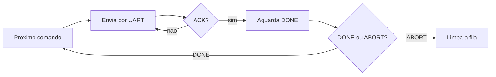

# Firmware da mestre

`esp_master/` · C sobre **ESP-IDF v5.5**

É a placa que fala com o operador. Conecta ao Wi-Fi, serve a interface web e coordena a missão,
despachando um comando por vez à escrava.

## Recursos

| Recurso | Implementação |
|---|---|
| **Rede** | Wi-Fi em modo SoftAP ou STA |
| **Interface** | Servidor **HTTP** com a SPA de controle embarcada |
| **Coordenação** | Fila de comandos + **máquina de estados** de despacho |
| **Link com a escrava** | **UART1** (`TX=17` / `RX=16`), 3 bytes com checksum XOR |

## A máquina de estados de despacho

Para cada ação da rota, o ciclo é sempre o mesmo:



**Nada é enviado em paralelo.** A mestre só despacha o próximo comando depois do `DONE` do
anterior — é o que garante a ordem da rota e o que permite abortar de forma limpa.

`ABORT` e parada de emergência **esvaziam a fila**: o robô não retoma a missão sozinha depois de
uma interrupção, o que seria perigoso já que a posição real deixou de corresponder à planejada.

## Endpoints HTTP

| Método | URI | Ação |
|---|---|---|
| `GET` | `/` | Página de controle (SPA embarcada) |
| `GET` | `/api/status` | Estado da fila — `{ "fila": N }` |
| `POST` | `/api/route` | Enfileira os comandos da rota |
| `POST` | `/api/emergency` | Limpa a fila e para o robô |

A API é deliberadamente pequena. Toda a inteligência de montagem da rota está no navegador; a
mestre recebe uma lista de ações já resolvida e cuida apenas de executá-la em ordem.

## Configuração de rede

O firmware espera as credenciais em um arquivo que **não é versionado**:

```bash
cd esp_master
cp main/secrets.h.example main/secrets.h   # edite WIFI_SSID / WIFI_PASS
```

!!! warning "Credencial não entra no repositório"
    O `secrets.h` fica fora do controle de versão, e o repositório guarda apenas o `.example`.
    Senha de Wi-Fi commitada permanece no histórico do git mesmo depois de removida.

## Compilar

```bash
cd esp_master
idf.py set-target esp32s3
idf.py build
idf.py -p <PORTA> flash monitor
```

Ver [compilar e gravar](../compilar.md) e a [pinagem](../hardware.md).
