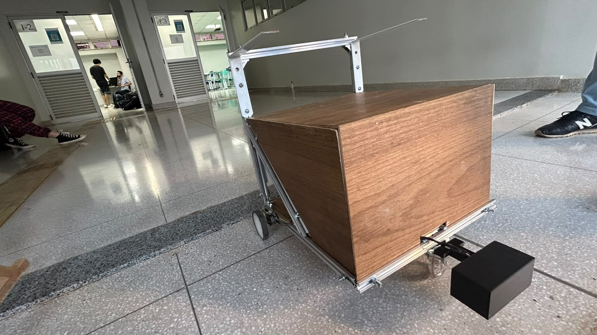
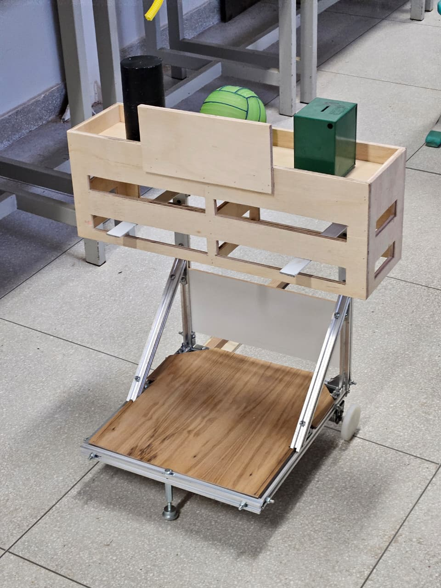

---
hide:
  - navigation
---

# Wall-Eight

**Carrinho autônomo de transporte de carga** · Projeto Integrador 2 — FGA/UnB

{ .hero-img }

O apelido vem do formato, que lembra o robô Wall-E, somado ao número do grupo: **8** →
*eight*.

## O que o robô faz

Navega de forma autônoma para transportar carga entre pontos demarcados. O operador monta a rota
em uma **interface web embarcada**; a placa mestre enfileira os comandos e os despacha à escrava,
que executa cada movimento em **malha fechada**.

- :material-chip: **Duas ESP32-S3**

    Mestre e escrava, comunicando por UART com protocolo de 3 bytes e checksum.

- :material-car-shift-pattern: **Tração diferencial**

    Dois motores DC com encoder Hall, drivers BTS7960 e PWM a 20 kHz.

- :material-compass: **Controle de rumo**

    Giroscópio MPU-6050 fecha os giros por ângulo, eliminando o acúmulo de erro do encoder.

- :material-alert-octagon: **Sensor de queda**

    IR reflexivo aborta o movimento ao detectar borda e avisa a mestre.

## Demonstração

| Operação completa | Apresentação final |
|:---:|:---:|
|  |  |
| Robô cumprindo a missão completa de navegação com a carga | Chegada autônoma ao ponto de entrega |

Bônus: [compilação do firmware no ESP-IDF](https://youtu.be/i_dLAfPBTEo).

## Galeria

<figure markdown>

<figcaption>Carroceria de carga sobre o chassi de perfil de alumínio</figcaption>
</figure>
<figure markdown>

<figcaption>Motores, rodas e a eletrônica embarcada sob a plataforma</figcaption>
</figure>

<figure markdown>

<figcaption>Equipe do projeto — Grupo 8, PI2 / FGA-UnB</figcaption>
</figure>

## Por onde começar

- **[Arquitetura](arquitetura.md)** — como as duas placas dividem o trabalho e conversam entre si

- **[Firmware da escrava](firmware/escrava.md)** — motores, encoders, giroscópio e o controle em malha fechada

- **[Firmware da mestre](firmware/mestre.md)** — Wi-Fi, servidor HTTP, fila de comandos e máquina de estados

- **[Pinagem completa](hardware.md)** — todas as ligações, das duas ESPs aos sensores e drivers

## Sobre este repositório

!!! note "Versionamento pessoal"
    Este é o **acompanhamento individual** do trabalho do Genilson no projeto, com foco no
    firmware embarcado e na interface de controle. Não substitui o repositório oficial do grupo.

## Stack

| Camada | Tecnologia |
|---|---|
| Microcontrolador | ESP32-S3 (duas placas) |
| Framework | ESP-IDF v5.5 + FreeRTOS |
| Linguagem | C |
| Motores | BTS7960 com PWM via LEDC a 20 kHz |
| Odometria | Encoders Hall lidos por PCNT |
| Rumo | Giroscópio MPU-6050 por I²C |
| Comunicação | UART entre placas · Wi-Fi e BLE para o operador |

[Ver no GitHub](https://github.com/GenilsonJrs/carrinho-autonomo-pi2){ .md-button }
[Assistir à operação](https://youtu.be/V_NZtubakYI){ .md-button .md-button--primary }
